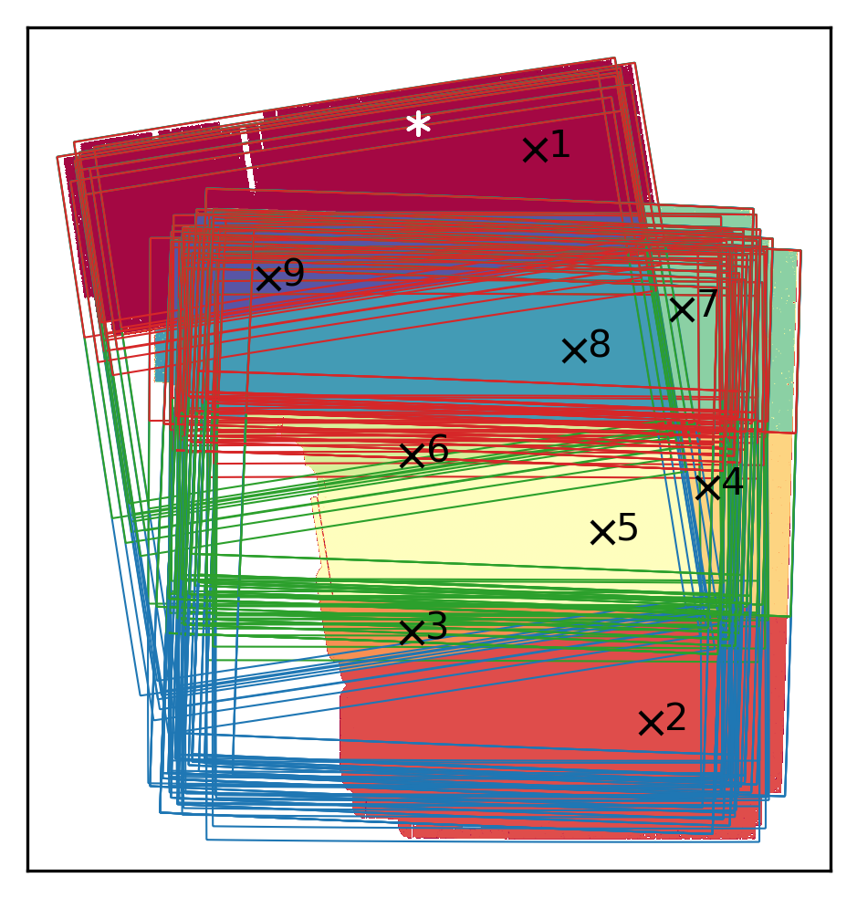

# midis_psf
The MIRI Deep Imaging Survey (MIDIS) Point Spread Function (PSF)
model.  For details, please refer to Appendix A of [Boogaard et
al. 2023b](https://arxiv.org/abs/2308.16895).

The empirical PSF models that were used to construct these PSFs can be
found at https://github.com/jensmelinder/miripsfs.

If you use either of the above PSF models, please cite [Boogaard et
al. 2023b](https://arxiv.org/abs/2308.16895).

## Usage

On the command line:
``` shell
midis_psf.py 53.1751187 -27.7665497 -fTrue -p60  # return psf filename only (default), at 60mas (default)
midis_psf.py 0 0 -i5 -p40                        # return psf number 5 at 40mas (coordinates are superseded by -i)
```

In python:
``` python
import midis_psf
psf = midis_psf.get_psf(53.1751187, -27.7665497, filename_only=False, pixscale=30)   # returns psf at coords, 30mas
psf = midis_psf.get_psf(0, 0, 5, filename_only=False, pixscale=40)                   # returns psf no. 5, at 40mas
```

## The Data


