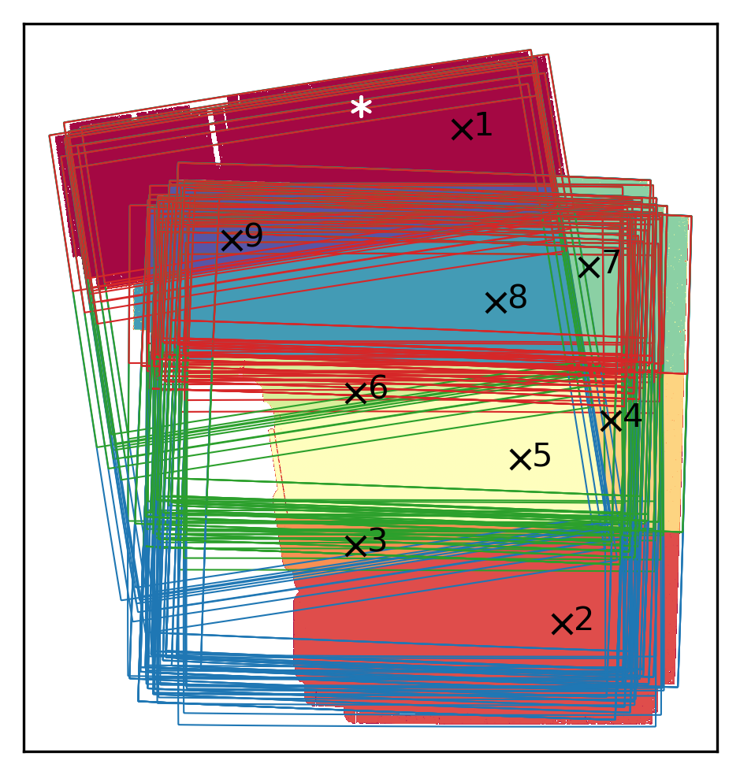
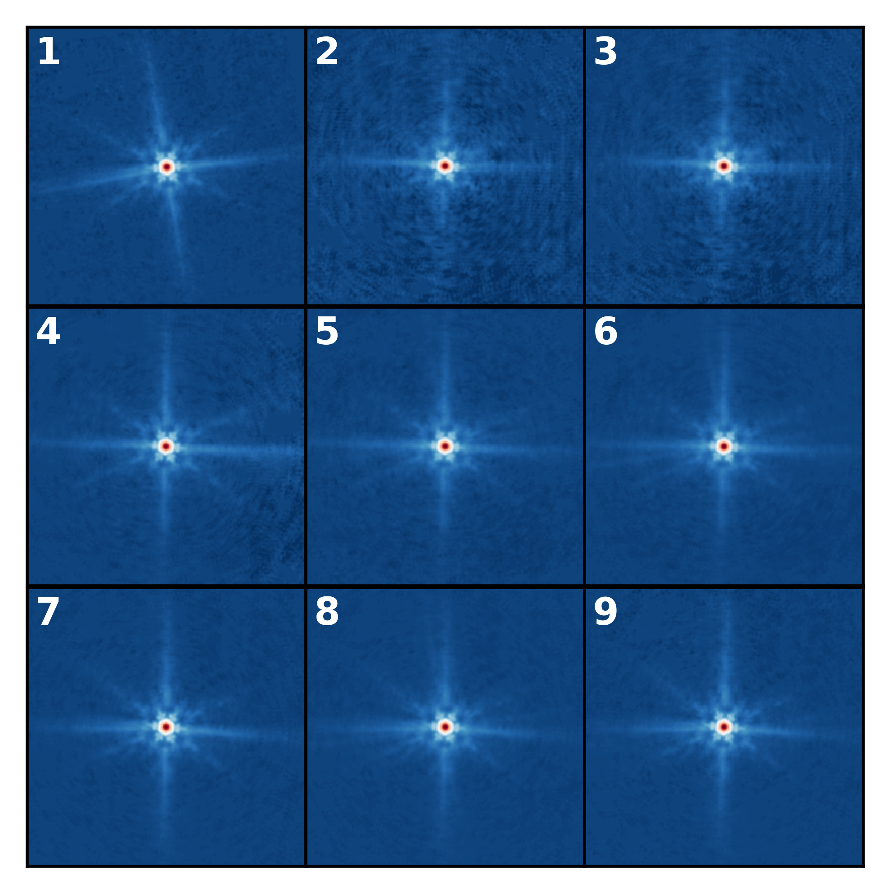

# midis_psf
MIRI Deep Imaging Survey PSF

## Usage

On the command line:
``` shell
midis_psf.py 53.1751187 -27.7665497 -fTrue -p60  # return psf filename only (default), at 60mas (default)
```

In python:
``` python
import midis_psf
psf = midis_psf.get_psf(53.1751187, -27.7665497, filename_only=False, pixscale=30)   # returns psf data, at 30mas
```

## The Data (v2)
See Boogaard et al. (in prep.) for more details.


