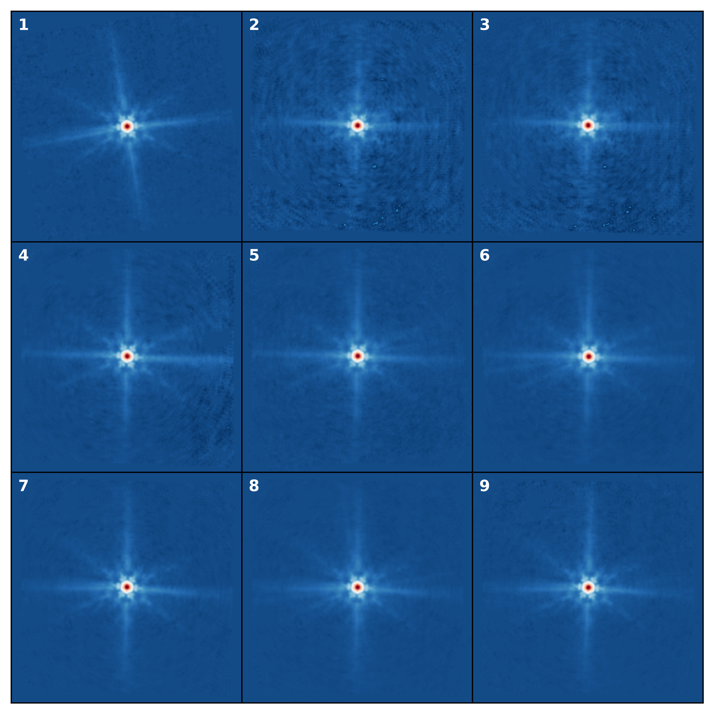

# midis_psf
MIRI Deep Imaging Survey PSF

## Usage

On the command line:
``` shell
midis_psf.py 53.1751187 -27.7665497   # return psf filename only (default)
```

In python:
``` python
import midis_psf
psf = midis_psf.get_psf(53.1751187, -27.7665497, filename_only=False)   # returns psf data
```

## The Data (v2)
See Boogaard et al. (in prep.) for more details.


